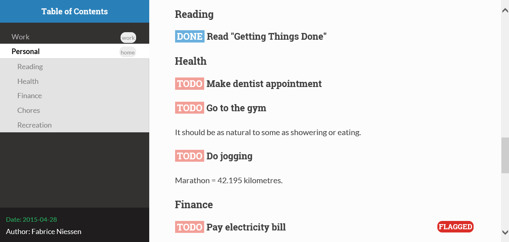

#+TITLE:     How to effortlessly transform your Org mode files into stunning HTML in just 2 minutes
#+AUTHOR:    Fabrice Niessen
#+EMAIL:     (concat "fniessen" at-sign "pirilampo.org")
#+DESCRIPTION: Org-HTML export made simple.
#+KEYWORDS:  org-mode, export, html, theme, style, css, js, bigblow
#+LANGUAGE:  en

#+OPTIONS:   H:4 toc:t num:2
#+PROPERTY:  header-args :padline no

#+SETUPFILE: ~/org/setup/html-theme-readtheorg.setup
#+SETUPFILE: ~/org/setup/latex-listings.setup

#+LATEX_HEADER: \usepackage{boostboxes}

#+html: <a href="http://opensource.org/licenses/GPL-3.0">
#+html:   
#+html: </a>
#+html: <a href="https://www.paypal.com/cgi-bin/webscr?cmd=_donations&business=VCVAS6KPDQ4JC&lc=BE&item_number=org%2dhtml%2dthemes&currency_code=EUR&bn=PP%2dDonationsBF%3abtn_donate_LG%2egif%3aNonHosted">
#+html:   
#+html: </a>

* Overview

** Description

While Org mode provides /basic/ HTML support, you can effortlessly enhance your
document's appearance by overriding CSS stylesheets and adding custom HTML
themes.

*Org-HTML Themes* is an innovative, open-source framework that delivers
a collection of stunning, cross-browser themes designed to transform your Org
documents. Use these themes to elevate your document's visual design, create
professional-looking reports, and impress colleagues with polished, visually
appealing content.

#+html: <a href="https://mastodon.social/share?text=Check%20out%20these%20amazing%20Org-HTML%20themes!%20https://github.com/fniessen/org-html-themes" target="_blank" rel="noopener noreferrer">Share on Mastodon</a>

Follow [[https://mastodon.social/@fniessen][@fniessen on Mastodon]] for the latest updates on Org-HTML themes!

** Requirements

Org mode version 8 (or later) is required.

If such a version is not bundled with your Emacs, install one from ELPA.

* Gallery
:PROPERTIES:
:ID:       79e0ed21-c3b0-4f00-bdab-29fbff9dcad4
:END:

This is a list of available *HTML themes for Org mode*, which you can use right
now!

** Bigblow

Bigblow is perfect for your work: it is a clean design aimed at optimal *Org
mode experience in your browser*.  It looks just awesome!

#+ATTR_HTML: :width 640
[[https://www.youtube.com/watch?v=DnSGSiXYuOk][file:docs/images/bigblow.png]]

Click on the image for a quick [[https://www.youtube.com/watch?v=DnSGSiXYuOk][demo of Bigblow]] (2:49 min, no audio).

Keyboard shortcuts to save time and boost your productivity:

| Shortcut | What it does                      |
|----------+-----------------------------------|
| =?= or =h=   | Access the *dashboard*              |
| =n=        | Move to the *next* main heading     |
| =p=        | Move to the *previous* main heading |
| =b=        | Scroll up                         |
| =<=        | Scroll to top                     |
| =>=        | Scroll to bottom                  |
| =-=        | Collapse all                      |
| =+=        | Expand all                        |
| =r=        | Go to next task in list           |
| =R=        | Go to previous task in list       |
| =q=        | Stop reviewing the list of tasks  |
| =g=        | Reload the page                   |

*** What people are saying about Bigblow

"Very very nice, I enjoy it a lot." \\
-- /Ista Zahn/

"This is awesome.  I love it!" \\
-- /Rainer M Krug/

"This is awesome!!" \\
-- /Mehul Sanghvi/

"This very nice html theme. [...]  I cannot use another emacs-theme than your
[[https://github.com/fniessen/emacs-leuven-theme][emacs-leuven-theme]], and it is going to be probably the same with your html
theme!" \\
-- /Joseph Vidal-Rosset/

"Thanks a lot for sharing [...] the wonderful Bigblow theme.  I create lot of
specification for other team members to use.  It has always been a trouble to
share and maintain such spec.  Now, I can create a much neater spec which is
available for the team's reference as a webpage." \\
-- /Shankar R./

"I like Bigblow the best.  I've exported most of my Org files using this theme
and published them within my company's intranet.  Thanks for sharing this
wonderful package!" \\
-- /Richard K./

** ReadTheOrg

ReadTheOrg is a clone of the official -- and great! -- [[https://github.com/snide/sphinx_rtd_theme][Sphinx theme]] used in the
[[http://docs.readthedocs.org/en/latest/][Read The Docs]] site.  It gives a beautiful and professional style to all your Org
docs.

*Thanks to its creator(s)!*

#+ATTR_HTML: :width 640

#+begin_note
While the original theme shines on mobile devices as well, ReadTheOrg does not
stay completely functional.

I don't have a lot of time to maintain this project due to other
responsibilities.  Help is welcome to work on that (and eventually improve the
default structure of the HTML export)!
#+end_note

*** What people are saying about ReadTheOrg

"OMG.  The ReadTheOrg theme for exported HTML from org mode files is eye
wateringly beautiful.  Thank you!" \\
-- /Rob Stewart/

"It is fantastic, so beautiful.  I will switch several of my pages over to
this theme." \\
-- /Carsten D./

"That is incredibly impressive.  Thanks for this." \\
-- /Noah R./

"Thank you!  I enjoy your themes.  The best ones I've ever found." \\
-- /Kang T./

"Awesome theme.  Wonderful job.  You're doing a wonderful thing --- it will
enable people (at least those who use Emacs and Org mode) to put together
on-line reference works in a much-more usable fashion than is currently
available." \\
-- /D. C. Toedt/

"Extremely useful." \\
-- /Thomas S. Dye/

"This is amazing, I've been looking for something like this for a LONG time!
I will share." \\
-- /Edward H./

* Demo

I've written a [[file:examples/org-mode-syntax-reference.org][demo page]] for the themes that provides a maximal working support
of Org mode syntax.

Please see the [[https://github.com/fniessen/refcard-org-mode][Org mode refcard]] page for full examples of headings, code,
admonitions, footnotes, tables and other details.

* Setup files renamed (important notice)

** Change of SETUPFILE names

As of [2026-01-24 Sat], the Org-HTML themes setup files have been *renamed*.

The old names:

- =theme-bigblow.setup=
- =theme-readtheorg.setup=

are *deprecated* and replaced by:

- =html-theme-bigblow.setup=
- =html-theme-readtheorg.setup=

** Relocated setup files

As of [2026-07-10 Fri], all setup files have been moved to the =org/setup/=
directory.

For example, update:

#+begin_example
,#+SETUPFILE: https://fniessen.github.io/org-html-themes/org/html-theme-bigblow.setup
#+end_example

to:

#+begin_example
,#+SETUPFILE: https://fniessen.github.io/org-html-themes/org/setup/html-theme-bigblow.setup
#+end_example

and similarly for the ReadTheOrg theme.

** Backward compatibility and warning banner

Org files using the old names still work, but a warning banner is injected into
the exported HTML page, and a warning is printed in the browser console.

** What you should do

To avoid the warning and ensure future compatibility, update your Org files to
use the new setup file names.

#+begin_src org :exports code
,#+SETUPFILE: html-theme-NAME.setup
#+end_src

* Using a theme

Using a theme from the Org HTML [[id:79e0ed21-c3b0-4f00-bdab-29fbff9dcad4][theme gallery]] in your own Org documents is
straightforward:

1. *Add a* =#+SETUPFILE:= *directive* in the preamble of your document to include the
   required CSS and JavaScript files.

   - You may reference the setup file directly via GitHub Pages:

     #+begin_src org :exports code
     ,#+SETUPFILE: https://fniessen.github.io/org-html-themes/org/setup/html-theme-NAME.setup
     #+end_src

     where =NAME= is either =bigblow= or =readtheorg=.

   - Alternatively, to avoid any dependency on an Internet connection, *clone or
     download* the =org-html-themes= repository and use the corresponding (relative
     or absolute path to the) local setup file:

     #+begin_src org :exports code
     ,#+SETUPFILE: PATH/TO/org/setup/html-theme-NAME-local.setup
     #+end_src

     In that case, the =src/= directory from the repository must be copied into
     the same directory as the Org file being exported (so that the exported
     HTML can find the theme assets via relative paths).

2. Finally, *export* the Org file *to HTML* using =org-html-export-to-html= or with
   =C-c C-e h h=.

* Customizing a theme

You love those themes, but you still would like to override particular HTML
tags?  Some examples do follow...

Before doing that, though, if you think it really is an improvement that could
serve other persons as well, including me, you're invited to submit your
change...

** Change the background code blocks

Here's an example to insert into your Org documents:

#+begin_src org
# Change the background of source block.
,#+HTML_HEAD: 
#+end_src

** Disable the ReadTheOrg search bar

The ReadTheOrg theme includes a client-side search bar by default.

You can disable it by adding the following macro *after* the =#+SETUPFILE= directive
and *before* the rest of your document:

#+begin_src org
{{{disable-search}}}
#+end_src

The search feature is enabled by default.

To limit the maximum number of displayed results, use:

#+begin_src org
{{{set-search-limit(10)}}}
#+end_src

A value of =0= (the default) disables the limit and displays all matching results.

** Unset body width limit of ReadTheOrg

Solution provided by Malcolm Cook:

#+begin_src org
,#+HTML_HEAD: 
,#+HTML_HEAD: 
,#+HTML_HEAD: <style> li{max-width:800px;}</style
#+end_src

* Contribute to the project!

** Report issues and enhancements

Found a bug or have an idea for a new feature?  Share your thoughts on the
[[https://github.com/fniessen/org-html-themes/issues/new][GitHub issue tracker]].

** Submit patches

I welcome contributions in any form!  Feel free to submit patches to enhance the
project.

** Support development with a donation!

If you find the "org-html-themes" project (or any of [[https://github.com/fniessen/][my other projects]])
enhancing your Emacs experience and simplifying your workflow, seize the
opportunity to express your appreciation!  Help fuel future development by
making a [[https://www.paypal.com/cgi-bin/webscr?cmd=_donations&business=VCVAS6KPDQ4JC&lc=BE&item_number=org%2dhtml%2dthemes&currency_code=EUR&bn=PP%2dDonationsBF%3abtn_donate_LG%2egif%3aNonHosted][donation]] through PayPal. Your support is invaluable -- thank you!

Remember, regardless of donations, "org-html-themes" will always remain freely
accessible, both as in Belgian beer and as in speech.

* License

Copyright (C) 2011-2026 Fabrice Niessen. All rights reserved.

Author: Fabrice Niessen \\
Keywords: org-mode html themes

This program is free software; you can redistribute it and/or modify it under
the terms of the GNU General Public License as published by the Free Software
Foundation, either version 3 of the License, or (at your option) any later
version.

This program is distributed in the hope that it will be useful, but WITHOUT ANY
WARRANTY; without even the implied warranty of MERCHANTABILITY or FITNESS FOR
A PARTICULAR PURPOSE.  See the GNU General Public License for more details.

You should have received a copy of the GNU General Public License along with
this program.  If not, see http://www.gnu.org/licenses/.

#+html: <a href="http://opensource.org/licenses/GPL-3.0">
#+html:   
#+html: </a>
#+html: <a href="https://www.paypal.com/cgi-bin/webscr?cmd=_donations&business=VCVAS6KPDQ4JC&lc=BE&item_number=org%2dhtml%2dthemes&currency_code=EUR&bn=PP%2dDonationsBF%3abtn_donate_LG%2egif%3aNonHosted">
#+html:   
#+html: </a>
